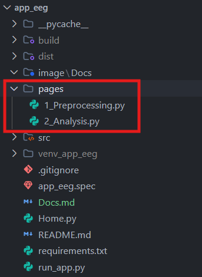
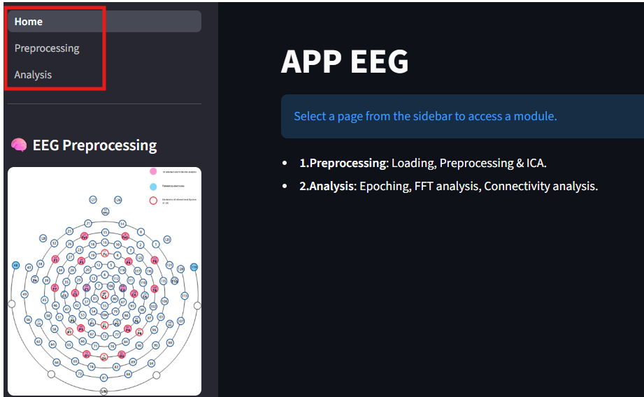

# Documentation Technique - Application EEG

Ce document décrit l'architecture, la structure du code et les méthodes de déploiement de l'application EEG.

## I. Architecture Globale

### 1. Principe de Streamlit et structure du code

**Streamlit**
L'application est construite avec **Streamlit**, un framework Python open-source qui permet de créer des applications web interactives pour l'analyse de données sans nécessiter de connaissances préalables en développement web front-end (HTML/CSS/JS). Le fonctionnement de Streamlit est "réactif" (reactive) : à chaque interaction de l'utilisateur avec un composant (comme un clic sur un bouton ou une sélection dans un menu), le script Python est rechargé et exécuté de haut en bas avec la nouvelle valeur de l'état.

**Point d'entrée : `Home.py`**
Le fichier `Home.py` est le point de départ de l'application. Il sert pour executer l'application depuis le terminal, il suffit d'utiliser la commande `streamlit run Home.py` pour que le serveur local démarre et qu'une page web avec le contenu du fichier Home.py s'affiche.

**Le dossier `/pages`**
Streamlit gère nativement les applications multi-pages de manière très simple via la structure de dossiers. Tout fichier `.py` placé dans le dossier `/pages` est automatiquement détecté par Streamlit et ajouté au menu latéral de navigation (la barre latérale). Le nom du fichier dicte le nom de l'onglet dans la barre de navigation.

**Structure du répertoire `src/`**
Le dossier `src/` contient l'ensemble du code modulaire, structuré de la manière suivante :

- **`src/components/`** : Regroupe le code de l'interface utilisateur Streamlit, partitionné en composants logiques.
- **`src/functions/`** : Regroupe tout le code de calcul, les analyses MNE, les algorithmes de filtrage et le traitement des données brutes, sans aucune implication d'interface utilisateur.
- **`src/constants/`** : Contient tous les paramètres fixes, les dictionnaires de configurations, les listes de canaux, etc. Cela permet d'éviter les valeurs codées en dur (les "magic numbers").
- **`src/images/`** : Stocke les ressources graphiques statiques utiles pour l'application.

**Fichier `requirements.txt`**
Ce fichier liste toutes les dépendances (bibliothèques tierces) nécessaires. Pour isoler l'environnement de développement, il est recommandé d'utiliser un environnement virtuel (venv) Python :

1. Création de l'environnement : `python -m venv venv_app_eeg`
2. Activation : `.\venv_app_eeg\Scripts\activate` (sur Windows) ou `source venv_app_eeg/bin/activate` (sur Mac/Linux).
3. Installation des dépendances : `pip install -r requirements.txt`.

**Fichier `run_app.py`**
Ce fichier sert de point d'entrée pour la création d'un exécutable de l'application (avec PyInstaller), expliqué plus en détail dans la section Déploiement de ce document.

### 2. La philosophie du code : "Un fichier, une fonction"

L'architecture du code a été pensée autour d'un principe fort de modularité : **un fichier = une fonction** (ou une classe/composant unique).
Ce principe offre plusieurs avantages critiques :

- **Lisibilité** : Les fichiers restent courts, spécialisés et donc simples à comprendre.
- **Maintenabilité et Débogage** : Il est aisé de retrouver le fichier exact impliqué en cas de problème.
- **Évolutivité** : Ajouter une fonctionnalité implique souvent de simplement créer un nouveau fichier.

**Exceptions à ce principe :**

- Les fichiers dans le dossier `constants/` qui regroupent plusieurs constantes logiquement liées.
- Les fichiers dans `functions/` qui nécessitent des fonctions internes qui ne seront pas appelées en dehors de ce même fichier. Ces fonctions internes sont préfixées par un underscore `_` (par exemple, dans `analyze_fft.py`, on trouve `_get_roi_band_power()`).

### 3. Séparation entre "Composants" et "Fonctions"

Un autre principe architectural majeur est la séparation stricte des préoccupations (Separation of Concerns).

- **Les Composants (`src/components/`)** : Ce sont les seuls éléments qui sont dépendants de l'interface graphique (`streamlit`). Ils génèrent les éléments visuels, récupèrent les paramètres choisis par l'utilisateur et affichent les résultats.
- **Les Fonctions (`src/functions/`)** : Ces fichiers contiennent le "backend" (algorithmes d'analyse, connectivité, etc.). **Ces fonctions sont totalement indépendantes de Streamlit.** Elles prennent des données en paramètres et retournent des résultats calculés. Cela permet de réutiliser ce code dans n'importe quel autre contexte (script batch, API, etc.).

### 4. Nomenclature

Afin de garantir la cohérence dans l'ensemble du projet, une nomenclature stricte est appliquée :

- **Fichiers et Fonctions/Composants identiques** : Pour les dossiers `functions` et `components`, le nom du fichier `.py` doit correspondre exactement au nom de la fonction ou du composant qu'il contient.
- **Pages Streamlit (`/pages`)** : Le nom des fichiers commence par un numéro suivi d'un underscore (`_`) pour forcer l'ordre d'affichage (ex: `1_Preprocessing.py`). Le numéro et l'underscore ne sont pas visibles sur l'interface.
- **Casse du code** :
  - Les **fonctions** utilisent le format `snake_case` (ex: `notch_filter()`).
  - Les **composants** utilisent le format `UpperCamelCase` (ex: `PlotConnectivity()`).
  - Les **constantes** utilisent le format `SCREAMING_SNAKE_CASE` (ex: `DEFAULT_CHANNELS`), mais le nom de leurs fichiers `.py` reste en `snake_case`.

---

## II. Détails des Modules (ou Features) de l'application

Cette section détaille le rôle de chaque composant majeur de l'application, ainsi que les concepts scientifiques et traitements mathématiques sous-jacents.

### 1) LoadMffFolder

Ce composant gère l'importation initiale des données brutes EEG, généralement issues d'appareils de type EGI (Electrical Geodesics, Inc.) au format `.mff`.

- **Fonctionnalités** : Il permet à l'utilisateur de charger un dossier `.mff`, de sélectionner un "Montage" (la disposition spatiale des électrodes sur le cuir chevelu, souvent basée sur le système international 10-20), de vérifier le typage des canaux (EEG, ECG pour le cœur, EOG pour les yeux) et de convertir le tout en un objet MNE `Raw` sauvegardé au format `.fif`.
- **Concepts** : Le typage correct des canaux est crucial car les étapes ultérieures (comme le filtrage ou l'ICA) ne doivent s'appliquer qu'aux données purement cérébrales (EEG) et exclure les signaux physiologiques annexes.

### 2) PreprocessEEG

Ce composant rassemble les étapes de nettoyage de base du signal EEG continu.

- **Fonctionnalités** :
  - **Filtre Notch** : Supprime le bruit de ligne électrique (50 Hz en Europe et ses harmoniques).
  - **Filtre Passe-bande (Bandpass)** : Conserve uniquement les fréquences physiologiques d'intérêt (souvent entre 0.5 Hz ou 1 Hz pour supprimer les lents mouvements, et 45 Hz ou 100 Hz pour couper le bruit haute fréquence).
  - **Interpolation** : Recrée le signal de canaux défectueux (capteurs cassés ou bruités) en calculant une moyenne spatiale pondérée des capteurs voisins.
  - **Référence commune (Average Reference)** : Re-référence tous les signaux par rapport à la moyenne de l'ensemble des capteurs pour standardiser les données.
- **Concepts mathématiques** : Les filtres utilisés sont généralement de type FIR (Finite Impulse Response) avec une phase nulle (zero-phase) pour éviter de décaler les signaux dans le temps, préservant ainsi la synchronicité des ondes EEG.

### 3) IndependentComponentAnalysisEEG

L'Analyse en Composantes Indépendantes (ICA) est une technique avancée de nettoyage des artefacts (bruits non cérébraux).

- **Fonctionnalités** : Ce composant décompose le signal EEG complexe en plusieurs sous-composantes statistiquement indépendantes. L'utilisateur (ou un algorithme) peut ensuite identifier quelles composantes correspondent à des clignements d'yeux, des battements cardiaques ou des contractions musculaires, puis reconstruire le signal EEG propre en excluant ces artefacts.
- **Concepts mathématiques** : L'ICA est une méthode de séparation de sources aveugles (Blind Source Separation). Elle part du principe que l'EEG de surface est un mélange linéaire de sources cérébrales indépendantes et de sources de bruit. L'algorithme (comme FastICA ou Infomax) maximise la non-gaussianité des composantes extraites pour trouver les sources d'origine.

### 4) EpochingEEG

Cette étape découpe le signal EEG continu, qui peut durer des heures, en petits segments temporels appelés "époques" (Epochs).

- **Fonctionnalités** : Le composant se base sur des marqueurs événementiels (triggers) pour extraire des fenêtres de temps spécifiques relatives à ces événements.
- **Concepts** : L'epoching permet de moyenner plusieurs essais d'une même condition pour faire ressortir l'activité cérébrale liée à cet événement tout en noyant le bruit de fond asynchrone. Cela prépare également les données pour les analyses fréquentielles par condition.

### 5) AnalysisFFT avec PlotFFT

Ce module calcule et visualise la puissance du signal EEG dans différentes bandes de fréquences.

- **AnalysisFFT** : Convertit le signal EEG (domaine temporel) en fréquences (domaine fréquentiel). Il calcule la Densité Spectrale de Puissance (PSD) pour extraire la puissance relative ou absolue des bandes d'ondes classiques : Delta (1-4 Hz), Theta (4-8 Hz), Alpha (8-13 Hz), Beta (13-30 Hz) et Gamma (>30 Hz), souvent moyennées par Régions d'Intérêt (ROI - ex: Frontal, Pariétal).
  - *Concepts mathématiques* : Utilise la Transformée de Fourier Rapide (FFT), souvent via la méthode de Welch qui divise le signal en fenêtres superposées, calcule la FFT sur chaque fenêtre, puis moyenne les résultats pour réduire la variance du spectre.
- **PlotFFT** : Prend les résultats de l'analyse et génère des graphiques interactifs (histogrammes, topographies, boîtes à moustaches) pour comparer visuellement la puissance des bandes selon les sujets ou les conditions cliniques.

### 6) AnalysisConnectivity avec PlotConnectivity

Ce module évalue la "communication" ou synchronisation fonctionnelle entre différentes régions du cerveau.

- **AnalysisConnectivity** : Calcule des métriques de connectivité entre chaque paire d'électrodes ou régions du cerveau pour des bandes de fréquences spécifiques.
  - *Concepts mathématiques* : Contrairement à l'amplitude, la connectivité (comme analysée ici) mesure la cohérence de phase. Des algorithmes comme le **PLI (Phase Lag Index)** ou le **wPLI (weighted PLI)** sont souvent utilisés. Ils mesurent l'asymétrie de la distribution des différences de phase entre deux signaux, permettant de détecter une véritable communication neuronale tout en minimisant les faux positifs liés à la conduction de volume (le fait qu'une même source électrique soit lue par deux électrodes voisines).
- **PlotConnectivity** : Affiche les résultats calculés sous forme de visualisations de réseaux (par exemple des graphiques en cercle où les liens relient les différents nœuds/électrodes) pour illustrer les réseaux cérébraux et leur force de connexion.

---

## III. Déploiement

### 1. Conversion en application exécutable avec PyInstaller

Afin de pouvoir distribuer l'application sur des postes de travail où Python n'est pas installé, l'application est "packagée" en exécutable (`.exe` sous Windows) à l'aide de l'outil **PyInstaller**.

- **Le fonctionnement** : PyInstaller analyse l'ensemble du code Python et crée un seul gros fichier contenant non seulement le code de l'application, mais également l'interpréteur Python et toutes les dépendances tierces requises (comme numpy, MNE, streamlit).
- **Le fichier `app_eeg.spec`** : Ce fichier est vital, il indique à PyInstaller comment empaqueter l'application. On y définit notamment les dossiers cachés qu'il doit importer de force, comment inclure le dossier `pages/` et `src/`, ainsi que la gestion de certains paquets parfois capricieux avec les exécutables (comme les librairies de traitement de données).
- **Point de lancement** : Étant donné que Streamlit se lance habituellement via la ligne de commande, le point d'entrée pour l'exécutable passe souvent par le fichier `run_app.py` qui simule l'appel de `streamlit run` au sein de l'environnement packagé.

### 2. Pistes pour la Dockerisation de l'application

Bien que PyInstaller génère un exécutable Windows, la **Dockerisation** (via Docker) offre une autre approche de déploiement, orientée Cloud ou serveurs (Linux), et garantit une portabilité parfaite ("ça marchera toujours de la même façon, peu importe la machine hôte").

Pour dockeriser l'application, les étapes seraient les suivantes :

1. **Création d'un fichier `Dockerfile`** à la racine du projet avec les instructions suivantes :

   - Sélectionner une image de base Python légère (ex: `FROM python:3.10-slim`).
   - Installer les bibliothèques système potentielles requises pour MNE ou l'interface (via `apt-get update && apt-get install -y ...`).
   - Copier le fichier de dépendances (`COPY requirements.txt .`).
   - Installer les dépendances Python (`RUN pip install -r requirements.txt`).
   - Copier tout le code de l'application (le dossier actuel) vers le conteneur (`COPY . /app`).
   - Exposer le port réseau utilisé par Streamlit par défaut (`EXPOSE 8501`).
   - Définir la commande de lancement au démarrage du conteneur : `CMD ["streamlit", "run", "Home.py", "--server.port=8501", "--server.address=0.0.0.0"]`.
2. **Construction de l'image** :
   En exécutant `docker build -t app_eeg .`
3. **Lancement du conteneur** :
   L'application serait alors accessible via le navigateur web de la machine sur le port 8501, simplement en exécutant la commande : `docker run -p 8501:8501 app_eeg`.
